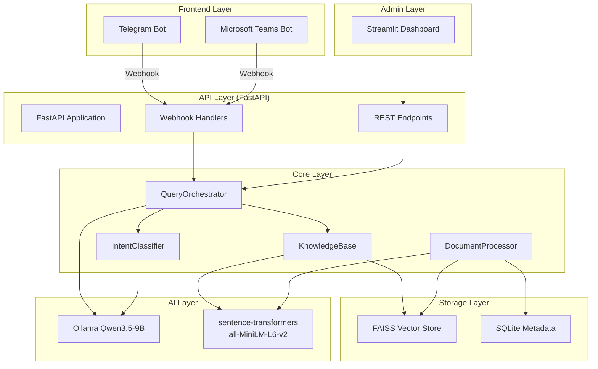

# IntelliKnow KMS - Full Implementation Plan

## Overview

Build **IntelliKnow KMS**, a production-ready Gen AI-powered Knowledge Management System that enables enterprises to ingest documents (PDF, DOCX), classify queries by intent (HR, Legal, Finance), and respond via multi-frontend integrations (Telegram, Microsoft Teams). The system includes an admin dashboard for document management, intent configuration, and analytics.

**Timeline**: 7 calendar days (1 week)  
**Team**: Solo developer  
**Scope**: MVP-focused with core functionality prioritized

**Key decisions from brainstorm (see: docs/brainstorms/2026-03-13-intelliknow-kms-architecture-brainstorm.md)**:
- Monolithic FastAPI architecture for fastest MVP delivery
- Streamlit for rapid admin dashboard development
- Local LLM (Qwen3.5-9B) via Ollama for data privacy and cost control
- FAISS + SQLite for vector and relational storage
- Telegram + Microsoft Teams for bot integrations

---

## Problem Statement

Enterprises struggle with fragmented information silos, inefficient knowledge retrieval, and employees wasting time searching for answers across multiple systems. IntelliKnow KMS addresses this by:

1. **Centralizing knowledge** from documents (PDFs, DOCX files) into a searchable vector database
2. **Enabling natural language queries** through familiar communication tools (Telegram, Teams)
3. **Classifying intents** to route queries to relevant knowledge domains (HR policies, legal contracts, financial procedures)
4. **Providing analytics** to identify knowledge gaps and popular queries

---

## Proposed Solution

A unified system with three core layers:

1. **Document Ingestion Layer**: Parse PDF/DOCX, chunk text, generate embeddings, store in FAISS
2. **Query Orchestration Layer**: Classify intent, retrieve relevant chunks, generate responses via LLM
3. **Multi-Frontend Layer**: Bot adapters for Telegram and Teams with webhook-based communication

**Admin Dashboard**: Streamlit-based interface for document management, intent space configuration, and analytics viewing.

---

## Technical Approach

### Architecture



### Data Flow

**Document Ingestion**:
```
Upload (PDF/DOCX) → Parse → Chunk (1000 tokens, 200 overlap) → 
Embed (all-MiniLM-L6-v2) → Store in FAISS (per intent space) → 
Save metadata in SQLite
```

**Query Processing**:
```
User Query → Intent Classification (Rule-based → LLM fallback) → 
Retrieve top-5 chunks from relevant FAISS index → 
Generate response with Qwen3.5-9B → Format for frontend → Return
```

### Project Structure

```
intelliknow-kms/
├── app/
│   ├── __init__.py
│   ├── main.py                    # FastAPI entry point
│   ├── config.py                  # Settings & configuration
│   ├── dependencies.py            # Dependency injection
│   │
│   ├── api/
│   │   ├── __init__.py
│   │   └── v1/
│   │       ├── __init__.py
│   │       ├── router.py          # API version router
│   │       └── endpoints/
│   │           ├── documents.py   # Document upload/management
│   │           ├── queries.py     # Query endpoint for testing
│   │           ├── health.py      # Health checks
│   │           └── analytics.py   # Analytics data
│   │
│   ├── bots/
│   │   ├── __init__.py
│   │   ├── telegram/
│   │   │   ├── __init__.py
│   │   │   ├── bot.py            # Telegram bot handler
│   │   │   └── webhook.py        # Telegram webhook endpoint
│   │   └── teams/
│   │       ├── __init__.py
│   │       ├── bot.py            # Teams bot handler
│   │       └── webhook.py        # Teams webhook endpoint
│   │
│   ├── core/
│   │   ├── __init__.py
│   │   ├── knowledge_base.py     # FAISS wrapper & search
│   │   ├── intent_classifier.py  # Intent classification logic
│   │   ├── document_processor.py # Document parsing & chunking
│   │   ├── query_orchestrator.py # Main orchestration logic
│   │   └── response_generator.py # LLM response generation
│   │
│   ├── models/
│   │   ├── __init__.py
│   │   ├── document.py           # Document Pydantic models
│   │   ├── query.py              # Query/Response models
│   │   ├── intent.py             # Intent space models
│   │   └── analytics.py          # Analytics models
│   │
│   └── db/
│       ├── __init__.py
│       ├── database.py           # SQLite connection & setup
│       ├── crud.py               # CRUD operations
│       └── faiss_manager.py      # FAISS index management
│
├── admin-dashboard/
│   ├── app.py                    # Main Streamlit entry
│   ├── config.py                 # Dashboard config
│   ├── utils.py                  # Dashboard utilities
│   └── pages/
│       ├── 1_Dashboard.py        # Overview & metrics
│       ├── 2_Documents.py        # Document management
│       ├── 3_Intent_Spaces.py    # Intent configuration
│       ├── 4_Integrations.py     # Bot integration settings
│       └── 5_Analytics.py        # Analytics & reports
│
├── tests/
│   ├── __init__.py
│   ├── conftest.py               # Pytest configuration
│   ├── test_document_processor.py
│   ├── test_intent_classifier.py
│   ├── test_knowledge_base.py
│   └── test_api.py
│
├── data/                         # Data directory (gitignored)
│   ├── faiss/                    # FAISS indexes
│   ├── uploads/                  # Uploaded documents
│   └── sqlite/                   # SQLite database
│
├── docs/
│   ├── brainstorms/
│   └── plans/
│
├── scripts/
│   ├── setup.sh                  # Setup script for China mirrors
│   └── start.sh                  # Start all services
│
├── docker-compose.yml
├── Dockerfile
├── requirements.txt
├── requirements-dev.txt
├── .env.example
├── .gitignore
└── README.md
```

---

## Implementation Phases

### Phase 1: Foundation & Infrastructure (Days 1-2)

**Goal**: Set up project structure, dependencies, database layer, and core models

#### Day 1: Project Setup & Core Infrastructure

**Tasks**:
1. **Initialize project structure**
   - Create all directories (`app/`, `tests/`, `admin-dashboard/`, `data/`)
   - Set up Python virtual environment
   - Configure China mirrors (pip, npm, Docker)

2. **Create configuration files**
   - `app/config.py`: Environment-based settings
   - `.env.example`: Template for environment variables
   - `requirements.txt`: Core dependencies
   - `requirements-dev.txt`: Development dependencies

3. **Set up database layer**
   - `app/db/database.py`: SQLite connection with SQLAlchemy
   - `app/db/crud.py`: Basic CRUD operations
   - Create initial schema for documents, queries, intent spaces

4. **Define Pydantic models**
   - `app/models/document.py`: Document, DocumentChunk, DocumentUpload
   - `app/models/query.py`: QueryRequest, QueryResponse, QueryLog
   - `app/models/intent.py`: IntentSpace, IntentClassification
   - `app/models/analytics.py`: QueryMetrics, DocumentMetrics

**Key Files**:
- `app/config.py`
- `app/db/database.py`
- `app/models/document.py`
- `app/models/query.py`

**Success Criteria**:
- [ ] Project structure created
- [ ] All dependencies installable
- [ ] SQLite schema created and migrations working
- [ ] Configuration loads from environment

#### Day 2: Document Processing & FAISS Integration

**Tasks**:
1. **Implement document parsing**
   - `app/core/document_processor.py`:
     - PDF parsing with PyPDF2/pdfplumber
     - DOCX parsing with python-docx
     - Text extraction and cleaning

2. **Implement text chunking**
   - Chunk documents into 1000-token segments with 200-token overlap
   - Handle overlapping chunks for semantic coherence
   - Preserve document metadata (page numbers, section headers)

3. **Set up embedding generation**
   - Integrate `sentence-transformers` with `all-MiniLM-L6-v2`
   - Batch embedding generation for efficiency
   - Cache embeddings to avoid recomputation

4. **Implement FAISS storage**
   - `app/db/faiss_manager.py`:
     - Create separate FAISS indexes per intent space
     - Index persistence and loading
     - Add/delete/search operations

5. **Create document upload endpoint**
   - `app/api/v1/endpoints/documents.py`:
     - POST /documents/upload
     - Support PDF and DOCX file types
     - Async processing with status tracking

**Key Files**:
- `app/core/document_processor.py`
- `app/db/faiss_manager.py`
- `app/api/v1/endpoints/documents.py`

**Success Criteria**:
- [ ] Can parse PDF and DOCX files
- [ ] Documents chunked correctly (1000 tokens, 200 overlap)
- [ ] Embeddings generated and stored in FAISS
- [ ] Upload endpoint working with status tracking

---

### Phase 2: Intent Classification & Query Orchestration (Days 3-4)

**Goal**: Build the core intelligence layer - intent classification and response generation

#### Day 3: Intent Classification System

**Tasks**:
1. **Implement rule-based classifier**
   - `app/core/intent_classifier.py`:
     - Keyword matching for common patterns
     - Support for HR, Legal, Finance keywords
     - Confidence scoring based on keyword matches

2. **Integrate LLM fallback**
   - Set up Ollama with Qwen3.5-9B
   - LLM-based classification for ambiguous queries
   - Hybrid routing: rule-based first, LLM fallback if confidence < 70%

3. **Create intent space management**
   - CRUD operations for intent spaces
   - Default spaces: HR, Legal, Finance, General
   - Support for custom intent spaces
   - Document-to-intent-space association

4. **Test classification accuracy**
   - Create test suite with sample queries
   - Measure accuracy against labeled data
   - Target: ≥70% classification accuracy

**Key Files**:
- `app/core/intent_classifier.py`
- `app/db/crud.py` (intent space operations)

**Success Criteria**:
- [ ] Rule-based classifier working with keyword matching
- [ ] LLM fallback integrated with Ollama
- [ ] Classification accuracy ≥70% on test set
- [ ] Can create/manage intent spaces

#### Day 4: Query Orchestration & Response Generation

**Tasks**:
1. **Build QueryOrchestrator**
   - `app/core/query_orchestrator.py`:
     - Receive query from any frontend
     - Classify intent
     - Retrieve relevant chunks from FAISS
     - Generate response with LLM
     - Log query and response

2. **Implement semantic search**
   - Query embedding generation
   - FAISS similarity search (top-k retrieval)
   - Filter by intent space
   - Re-ranking by relevance score

3. **Implement response generation**
   - `app/core/response_generator.py`:
     - Context assembly from retrieved chunks
     - LLM prompt engineering for accurate responses
     - Citation generation (source document references)
     - Format responses in Markdown

4. **Create query testing endpoint**
   - `app/api/v1/endpoints/queries.py`:
     - POST /queries/ask
     - Return response with citations and metadata
     - Include confidence scores and timing

**Key Files**:
- `app/core/query_orchestrator.py`
- `app/core/response_generator.py`
- `app/api/v1/endpoints/queries.py`

**Success Criteria**:
- [ ] Query orchestration working end-to-end
- [ ] Semantic search retrieving relevant chunks
- [ ] LLM generating accurate, cited responses
- [ ] Average response time < 3 seconds

---

### Phase 3: Bot Integrations (Days 5-6)

**Goal**: Integrate Telegram and Microsoft Teams bots

#### Day 5: Telegram Bot Integration

**Tasks**:
1. **Set up Telegram bot**
   - Create bot via BotFather
   - Get API token
   - Configure webhook URL

2. **Implement Telegram bot handler**
   - `app/bots/telegram/bot.py`:
     - Message reception and parsing
     - Command handling (/start, /help)
     - Query forwarding to orchestrator
     - Response formatting for Telegram (respecting message limits)

3. **Create Telegram webhook endpoint**
   - `app/bots/telegram/webhook.py`:
     - POST /webhooks/telegram
     - Verify webhook signature
     - Route to bot handler

4. **Add integration configuration**
   - Admin endpoint to configure Telegram bot token
   - Webhook setup/teardown
   - Connection testing

**Key Files**:
- `app/bots/telegram/bot.py`
- `app/bots/telegram/webhook.py`

**Success Criteria**:
- [ ] Telegram bot responds to /start and /help
- [ ] Can receive queries and return responses
- [ ] Webhook integration working
- [ ] Messages respect Telegram formatting constraints

#### Day 6: Microsoft Teams Bot Integration

**Tasks**:
1. **Set up Teams bot**
   - Register bot in Azure Portal
   - Get App ID and secret
   - Configure messaging endpoint

2. **Implement Teams bot handler**
   - `app/bots/teams/bot.py`:
     - Activity handling (message, member added)
     - Query forwarding to orchestrator
     - Adaptive card formatting for rich responses

3. **Create Teams webhook endpoint**
   - `app/bots/teams/webhook.py`:
     - POST /webhooks/teams
     - Verify JWT token from Teams
     - Route to bot handler

4. **Add Teams integration configuration**
   - Admin endpoint to configure Teams credentials
   - Connection testing
   - Rich response formatting (Adaptive Cards)

5. **Bot adapter abstraction**
   - Refactor common bot logic into base adapter
   - Platform-specific formatting (Telegram vs Teams)

**Key Files**:
- `app/bots/teams/bot.py`
- `app/bots/teams/webhook.py`

**Success Criteria**:
- [ ] Teams bot responds to messages
- [ ] Adaptive Cards working for rich responses
- [ ] Webhook integration with JWT verification
- [ ] Both bots tested end-to-end

---

### Phase 4: Admin Dashboard & Analytics (Day 7)

**Goal**: Build Streamlit admin dashboard and final integration

**Tasks**:
1. **Set up Streamlit structure**
   - `admin-dashboard/app.py`: Main entry with navigation
   - `admin-dashboard/config.py`: Dashboard configuration
   - Page routing and sidebar navigation

2. **Build Dashboard page** (`admin-dashboard/pages/1_Dashboard.py`)
   - System status overview
   - Key metrics (total documents, queries today, avg response time)
   - Recent activity feed
   - Quick actions

3. **Build Documents page** (`admin-dashboard/pages/2_Documents.py`)
   - Document list table with search/filter
   - Upload zone with drag-and-drop
   - Document details and delete functionality
   - Processing status indicators

4. **Build Intent Spaces page** (`admin-dashboard/pages/3_Intent_Spaces.py`)
   - Intent space cards (HR, Legal, Finance)
   - Create/edit/delete intent spaces
   - View classification logs
   - Accuracy metrics per space

5. **Build Integrations page** (`admin-dashboard/pages/4_Integrations.py`)
   - Telegram bot configuration
   - Teams bot configuration
   - Connection status indicators
   - Test buttons for each integration

6. **Build Analytics page** (`admin-dashboard/pages/5_Analytics.py`)
   - Query volume over time (line chart)
   - Intent distribution (pie chart)
   - Most accessed documents (bar chart)
   - Classification accuracy trends
   - Exportable data (CSV)

7. **Final integration & testing**
   - Docker Compose setup
   - End-to-end testing
   - Sample documents uploaded
   - Sample queries tested via both frontends

**Key Files**:
- `admin-dashboard/app.py`
- `admin-dashboard/pages/1_Dashboard.py`
- `admin-dashboard/pages/2_Documents.py`
- `admin-dashboard/pages/3_Intent_Spaces.py`
- `admin-dashboard/pages/4_Integrations.py`
- `admin-dashboard/pages/5_Analytics.py`

**Success Criteria**:
- [ ] All 5 dashboard pages functional
- [ ] Can upload documents via dashboard
- [ ] Can configure bot integrations
- [ ] Analytics showing real data
- [ ] Docker Compose deployment working

---

## System-Wide Impact

### Interaction Graph

**Document Upload Flow**:
```
User Upload → POST /documents/upload → DocumentProcessor.parse() → 
Text chunking → Embedding generation → FAISS index update → 
SQLite metadata save → Return document ID
```

**Query Flow**:
```
User Query → Bot Adapter → QueryOrchestrator.process() → 
IntentClassifier.classify() → KnowledgeBase.search() → 
ResponseGenerator.generate() → Format for platform → Return response
```

**Error Propagation**:
- Document parsing errors → Log to SQLite, return error status
- FAISS search errors → Fall back to keyword search, log warning
- LLM errors → Return "unable to answer" message, log error
- Bot webhook errors → Return 200 OK to platform, log error internally

### State Lifecycle Risks

| Operation | State Changes | Failure Mode | Mitigation |
|-----------|----------------|--------------|------------|
| Document Upload | File → Chunks → Embeddings → FAISS | Partial embedding failure | Transactional: delete partial on error |
| Query Processing | Query → Intent → Search → Response | LLM timeout | Return cached response or "try again" |
| Bot Webhook | Request → Process → Response | Handler crash | Return 200 to prevent retry storms |

### API Surface Parity

All bot adapters expose the same interface:
- `process_message(message: str) -> Response`
- `format_response(response: QueryResponse) -> PlatformMessage`

This ensures adding new platforms (WhatsApp, Slack) only requires implementing the adapter interface.

### Integration Test Scenarios

1. **Document Upload → Query Flow**:
   - Upload PDF → Verify indexed → Query via Telegram → Verify correct response

2. **Intent Classification Accuracy**:
   - Send 50 labeled queries → Verify ≥70% correctly classified

3. **Multi-Frontend Consistency**:
   - Send same query via Telegram and Teams → Verify identical responses

4. **Error Recovery**:
   - Kill LLM service mid-query → Verify graceful error message

5. **Concurrent Queries**:
   - Send 10 simultaneous queries → Verify all respond within 5 seconds

---

## Acceptance Criteria

### Functional Requirements

- [ ] Can upload PDF and DOCX documents via API and dashboard
- [ ] Documents automatically parsed, chunked, and indexed
- [ ] Intent classification achieves ≥70% accuracy on test set
- [ ] Queries via Telegram receive accurate, context-aware responses
- [ ] Queries via Microsoft Teams receive accurate, context-aware responses
- [ ] Responses include citations to source documents
- [ ] Admin dashboard shows real-time analytics (query volume, classification accuracy)
- [ ] Can create and manage custom intent spaces
- [ ] Can configure and test bot integrations from dashboard

### Non-Functional Requirements

- [ ] Average response time < 3 seconds for typical queries
- [ ] System handles 10 concurrent queries without degradation
- [ ] Document indexing completes within 30 seconds for 10-page PDF
- [ ] Docker Compose deployment works with single command
- [ ] All data persisted across container restarts

### Quality Gates

- [ ] Test coverage ≥70% for core modules (orchestrator, classifier, KB)
- [ ] All API endpoints documented with OpenAPI/Swagger
- [ ] README includes setup, usage, and troubleshooting guides
- [ ] Code passes linting (ruff, black)
- [ ] No hardcoded secrets or credentials

---

## Success Metrics

| Metric | Target | Measurement |
|--------|--------|-------------|
| Intent Classification Accuracy | ≥70% | Test set of 50 labeled queries |
| Average Response Time | <3s | Logged query timing data |
| Document Upload Success Rate | 100% | Successful / Total uploads |
| Bot Integration Uptime | 99% | Health check monitoring |
| Code Test Coverage | ≥70% | pytest-cov report |

---

## Dependencies & Prerequisites

### External Services
- **Ollama**: Must be running locally (or accessible via network)
  - Qwen3.5-9B model pulled and ready
  - Default port: 11434
- **Telegram Bot**: API token from BotFather
- **Microsoft Teams**: Azure bot registration (optional for MVP testing)

### System Requirements
- Python 3.10+
- 8GB+ RAM (for local LLM)
- 10GB+ disk space (for models and FAISS indexes)
- Docker & Docker Compose (for deployment)

### Python Dependencies
```
fastapi==0.104.*
uvicorn[standard]==0.24.*
streamlit==1.28.*
sqlalchemy==2.0.*
alembic==1.12.*
faiss-cpu==1.7.*
sentence-transformers==2.2.*
python-telegram-bot==20.6
botbuilder-core==4.14.*
pypdf2==3.0.*
python-docx==1.1.*
pydantic==2.5.*
python-multipart==0.0.*
httpx==0.25.*
pandas==2.1.*
plotly==5.18.*
```

---

## Risk Analysis & Mitigation

| Risk | Likelihood | Impact | Mitigation |
|------|------------|--------|------------|
| Ollama setup issues on China network | High | High | Pre-download model, use HF mirror |
| Teams bot registration delays | Medium | Medium | Prioritize Telegram, mock Teams for testing |
| Document parsing edge cases | Medium | Medium | Implement fallback parsers, log failures |
| LLM response quality poor | Low | High | Tune prompts, add response validation |
| Performance with large documents | Medium | Medium | Implement async processing, progress tracking |
| Concurrent query bottleneck | Low | Medium | Use async FastAPI, connection pooling |

---

## Resource Requirements

### Time Breakdown

| Phase | Days | Effort |
|-------|------|--------|
| Phase 1: Foundation | 2 | 16 hours |
| Phase 2: Intelligence | 2 | 16 hours |
| Phase 3: Integrations | 2 | 16 hours |
| Phase 4: Dashboard & Polish | 1 | 8 hours |
| **Total** | **7** | **56 hours** |

### AI Usage Strategy

| Task | AI Usage | Rationale |
|------|----------|-----------|
| Document parsing | AI-assisted | Generate parsing code for edge cases (tables, headers) |
| Intent classification | AI-powered | LLM-based classification for ambiguous queries |
| Response generation | AI-powered | Generate natural language responses from retrieved context |
| Dashboard UI | AI-assisted | Generate Streamlit component code |
| Test cases | AI-assisted | Generate test data and edge cases |

---

## Future Considerations

### Phase 2 Features (Post-MVP)
- Web interface for direct queries (not just bots)
- Support for more document formats (Excel, PowerPoint, images via OCR)
- User authentication and role-based access
- Advanced analytics (query trends, knowledge gaps)
- Multi-language support (Chinese, English, etc.)
- Document versioning and update tracking

### Scalability Improvements
- Migrate to ChromaDB or PostgreSQL + pgvector for larger scale
- Add Redis caching layer for frequent queries
- Implement Celery for background document processing
- Add monitoring with Prometheus + Grafana

### Integration Expansion
- Slack bot integration
- WhatsApp Business API
- Webhook API for custom integrations
- SSO (Single Sign-On) for enterprise

---

## Documentation Plan

| Document | Priority | Location |
|----------|----------|----------|
| README.md | Critical | Root directory |
| API Documentation | High | Auto-generated FastAPI Swagger |
| Setup Guide | High | README.md or docs/setup.md |
| Deployment Guide | Medium | docs/deployment.md |
| AI Usage Reflection | Required | docs/ai-usage.md |
| Architecture Decision Records | Low | docs/adr/ |

---

## Sources & References

### Origin

- **Brainstorm document:** [docs/brainstorms/2026-03-13-intelliknow-kms-architecture-brainstorm.md](docs/brainstorms/2026-03-13-intelliknow-kms-architecture-brainstorm.md)
- Key decisions carried forward:
  1. Monolithic FastAPI architecture (see brainstorm: Architecture Decisions)
  2. Qwen3.5-9B local LLM with all-MiniLM-L6-v2 embeddings (see brainstorm: Tech Stack Summary)
  3. Streamlit for admin dashboard (see brainstorm: Frontend Approach)

### Internal References

- Project root: `/home/samael/github/kms/`
- Brainstorms: `docs/brainstorms/`
- Plans: `docs/plans/` (this document)

### External References

- **FastAPI Documentation**: https://fastapi.tiangolo.com/
- **FAISS Documentation**: https://faiss.ai/
- **Streamlit Documentation**: https://docs.streamlit.io/
- **python-telegram-bot**: https://github.com/python-telegram-bot/python-telegram-bot
- **Microsoft Bot Framework**: https://github.com/microsoft/BotBuilder-Samples
- **Ollama**: https://ollama.ai/
- **Qwen Model**: https://github.com/QwenLM/Qwen

### Production Patterns Referenced

- **LangChain RAG Patterns**: https://github.com/langchain-ai/langchain
- **Vanna AI FAISS Implementation**: https://github.com/vanna-ai/vanna
- **Agno Document Readers**: https://github.com/agno-agi/agno

---

## Open Questions (To Resolve During Implementation)

1. **Document Update Strategy**: Delete all chunks and re-index (simpler) vs. track versions (complex)?
   - **Decision**: Start with delete + re-index for MVP

2. **Response Caching**: Cache LLM responses with TTL?
   - **Decision**: Implement simple in-memory cache with 1-hour TTL

3. **Authentication**: API key or JWT for admin dashboard?
   - **Decision**: Simple API key for MVP

4. **Multi-label Documents**: Support documents spanning multiple intent spaces?
   - **Decision**: Yes, allow multiple intent space tags per document

5. **Response Format**: Citations in Markdown format?
   - **Decision**: Yes, Markdown with inline citations

---

## Next Steps

1. Review this plan for any adjustments
2. Set up development environment with China mirrors
3. Begin Phase 1: Foundation & Infrastructure
4. Run `/ce:work` to start implementation with Claude Code

---

*Plan created: 2026-03-13*  
*Estimated duration: 7 days*  
*Total effort: 56 hours*